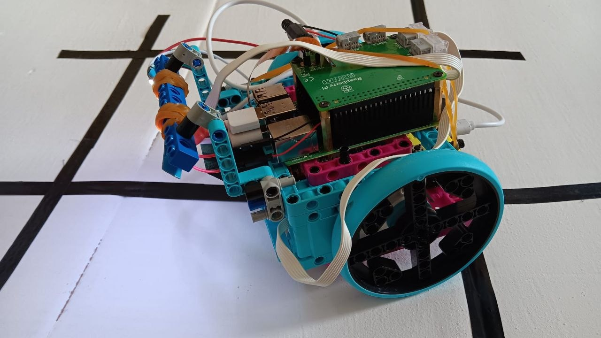

# Robocup

## Contexte
Notre équipe a un site web que vous pouvez consulter [ici](https://robacotfrancois1er.wixsite.com/team-robacot)

Et voici notre [chaine youtube](https://www.youtube.com/@Team-Robacot)

## Structure du projet

### Modules principaux

- dede.py : PROGRAMME PRINCIPAL
- camera.py  : initialisation de la caméra
- click_and_go.py : affiche une image, se déplace au point sur lequel on double clic
- enregistrement.py : enregistrement d'une video dans un second thread + avance en fonction des entrées clavier (curses)
- intersections.py : détection et affichage des lignes sur une image
- analyse.py : traitement de l'image et affichage des différentes étapes du processus
- demarrage.py : capte les informations envoyées par la microbit et renvoie la variable en_marche
- deplacements_robot.py : fonctions de déplacements du robot
- ligne_droite_spike2.py: ancien programme suivi d'une ligne avec enregistrement de la trajectoire

### Programmes de tests

- tutoriels: stocke les fichiers de découverte des différents éléments, pour mémoire
  - Barycentre: calcul du barycentre
  - tuto_opencv: afficher une image
  - tutoriel.py: exercice 2, question 4
  - commandes.py: découverte des commandes des moteurs pipounesques
  - chess: calibration de la caméra (effet de perspectives)
- Intersection
  - intersection.py: détection et affichage des lignes sur une image (intersection1.jpg)
  - inter_vid.py: détection et affichage des lignes sur une video
- Moteurs
  - controle.py: actionner les moteurs en fonction de l'entrée clavier 
  - deplacements_robot.py: fonctions pour déplacer le robot
  - stop.py: programme pour arreter les moteurs en cas d'urgence
- Suivi
  - suivi_droit.py et ligne_droite.py: suivi d'une ligne (barycentre) avec les moteurs pipounesques
  - ligne_droite_spike.py: suivi d'une ligne avec enregistrement de la trajectoire et les moteurs spike
- thread
  - enregistrement.py : enregistrement d'une video dans un second thread
  - enregistrement_maitrise.py: idem + avance en fonction des entrées clavier (avec input: ne fonctionne pas)

## Journal

- Janvier: suivi de ligne avec la caméra (barycentre), controle des moteurs pour prendre des videos de tests
- Fevrier: détection des lignes, se rendre à un point donné (click and go)
- Mars: calcul des intersections et analyse avec opencv
- Avril: finalisation du suivi de ligne + compétition régionale
